# 🚀 DevSecOps Infrastructure Pipeline

A fully automated, production-grade DevSecOps pipeline that provisions an EKS cluster, performs deep security audits on Docker images, and deploys via Jenkins using a **Pull pattern** from Amazon ECR.

---

## 🏗️ Architecture Overview

```mermaid
graph TB
    subgraph "CI/CD — Jenkins Pipeline"
        A[📥 Checkout] --> B[🔍 SCA - Trivy FS]
        B --> C[📋 Hadolint Lint]
        C --> D[🧪 Unit Tests]
        D --> E[📦 Build WAR]
        E --> F[🐳 Docker Build]
        F --> G[🛡️ Trivy Image Scan]
        G --> H{Quality Gate}
        H -->|PASS| I[📤 ECR Push]
        H -->|FAIL| X[❌ Build Failed]
        I --> J[📐 Terraform Plan]
        J --> K[⏸️ Manual Approval]
        K --> L[🚀 Terraform Apply]
        L --> M[☸️ Deploy to EKS]
    end

    subgraph "AWS Infrastructure — Terraform"
        N[VPC Module] --> O[3 Public + 3 Private Subnets]
        P[IAM Module] --> Q[OIDC Provider + IRSA]
        R[EKS Module] --> S[Managed Node Group]
        T[ECR Repository]
    end

    subgraph "Kubernetes — Day-2 Ops"
        U[Deployment] --> V[HPA - Auto-scaling]
        W[ALB Ingress] --> Y[TLS via ACM]
        Z[Metrics Server]
    end

    M --> U
    I --> T
    L --> N & P & R
```



---

## 📂 Folder Structure

```plaintext
.
├── terraform/                    # Phase 1: Infrastructure as Code
│   ├── backend.tf                # S3 + DynamoDB remote state
│   ├── main.tf                   # Root module (VPC + IAM + EKS + ECR)
│   ├── variables.tf              # Input variables
│   ├── outputs.tf                # Output values
│   ├── providers.tf              # AWS provider configuration
│   └── modules/
│       ├── vpc/                  # VPC with 3-AZ public/private subnets
│       ├── iam/                  # Cluster roles, OIDC, IRSA
│       └── eks/                  # EKS cluster + managed node group
├── kubernetes/                   # Phase 4: K8s manifests
│   ├── namespace.yaml            # vprofile namespace
│   ├── service-account.yaml      # IRSA-annotated service account
│   ├── deployment.yaml           # Rolling update deployment
│   ├── service.yaml              # ClusterIP service
│   ├── hpa.yaml                  # Horizontal Pod Autoscaler
│   ├── ingress.yaml              # ALB Ingress with TLS
│   └── metrics-server.yaml       # Metrics Server for HPA
├── app/                          # Application source code
│   ├── pom.xml                   # Maven build configuration
│   └── src/                      # Java source tree
├── Dockerfile                    # Phase 2: Multi-stage, non-root
├── .dockerignore                 # Minimize Docker build context
├── Jenkinsfile                   # Phase 3: 12-stage security pipeline
└── README.md
```

---

## 🔑 Key Features

### Phase 1 — Terraform Infrastructure
| Feature | Description |
|---|---|
| **Modular Design** | Separate VPC, IAM, and EKS modules |
| **OIDC + IRSA** | Pods assume IAM roles — no hardcoded AWS keys |
| **Remote State** | S3 + DynamoDB locking prevents state corruption |
| **3-AZ VPC** | Public/private subnets with NAT Gateway |
| **EKS Add-ons** | vpc-cni, coredns, kube-proxy auto-managed |

### Phase 2 — Secure Docker
| Feature | Description |
|---|---|
| **Multi-Stage Build** | Builder → Runtime (minimal image size) |
| **Non-Root User** | Container runs as `appuser`, not `root` |
| **Layer Caching** | POM copied first for optimal cache hits |
| **Health Check** | Built-in HEALTHCHECK instruction |

### Phase 3 — Jenkins Security Pipeline
| Feature | Description |
|---|---|
| **12 Stages** | Full CI/CD with security gates |
| **SCA (Trivy)** | Source code vulnerability scanning |
| **Hadolint** | Dockerfile best practices linting |
| **Trivy Image Scan** | Fails build on HIGH/CRITICAL CVEs |
| **Manual Approval** | Human gate before infrastructure changes |
| **ECR Auth** | Automated login/push lifecycle |

### Phase 4 — Kubernetes Day-2 Ops
| Feature | Description |
|---|---|
| **HPA** | CPU (50%) + Memory (70%) auto-scaling, 2–10 replicas |
| **ALB Ingress** | AWS Load Balancer Controller with TLS 1.3 |
| **Metrics Server** | Provides metrics for HPA decisions |
| **Security Context** | Non-root, dropped capabilities, no privilege escalation |

---

## ⚡ Quick Start

### Prerequisites
- AWS CLI configured with appropriate permissions
- Terraform >= 1.5.0
- Docker
- kubectl
- Jenkins (with Docker, AWS, and Kubernetes plugins)
- Trivy & Hadolint installed on Jenkins agents

### Step 1: Create Remote State Resources
```bash
# Create the S3 bucket for Terraform state
aws s3api create-bucket \
  --bucket devsecops-pipeline-tfstate \
  --region us-east-1

# Create the DynamoDB table for state locking
aws dynamodb create-table \
  --table-name devsecops-pipeline-tflock \
  --attribute-definitions AttributeName=LockID,AttributeType=S \
  --key-schema AttributeName=LockID,KeyType=HASH \
  --billing-mode PAY_PER_REQUEST \
  --region us-east-1
```

### Step 2: Provision Infrastructure
```bash
cd terraform
terraform init
terraform plan -out=tfplan
terraform apply tfplan
```

### Step 3: Configure kubectl
```bash
aws eks update-kubeconfig \
  --region us-east-1 \
  --name devsecops-pipeline-prod
```

### Step 4: Deploy Metrics Server
```bash
kubectl apply -f kubernetes/metrics-server.yaml
```

### Step 5: Deploy Application
```bash
kubectl apply -f kubernetes/namespace.yaml
kubectl apply -f kubernetes/service-account.yaml
kubectl apply -f kubernetes/deployment.yaml
kubectl apply -f kubernetes/service.yaml
kubectl apply -f kubernetes/hpa.yaml
kubectl apply -f kubernetes/ingress.yaml
```

### Step 6: Jenkins Pipeline
1. Create a new Pipeline job in Jenkins
2. Point it to your Git repository
3. Jenkins will auto-detect the `Jenkinsfile`
4. Configure the `aws-account-id` credential in Jenkins

---

## 🔧 Configuration

### Terraform Variables (`terraform/variables.tf`)
| Variable | Default | Description |
|---|---|---|
| `aws_region` | `us-east-1` | AWS region |
| `project_name` | `devsecops-pipeline` | Resource naming prefix |
| `environment` | `prod` | Environment tag |
| `vpc_cidr` | `10.0.0.0/16` | VPC CIDR block |
| `eks_cluster_version` | `1.29` | Kubernetes version |
| `eks_node_instance_types` | `["t3.medium"]` | Worker node instance types |
| `eks_desired_capacity` | `2` | Desired worker nodes |

### Placeholders to Replace
| File | Placeholder | Replace With |
|---|---|---|
| `kubernetes/service-account.yaml` | `<ACCOUNT_ID>` | Your AWS Account ID |
| `kubernetes/ingress.yaml` | `<ACCOUNT_ID>` | Your AWS Account ID |
| `kubernetes/ingress.yaml` | `<CERT_ID>` | Your ACM Certificate ID |
| `kubernetes/ingress.yaml` | `vprofile.yourdomain.com` | Your actual domain |

---

## 📄 License
MIT
